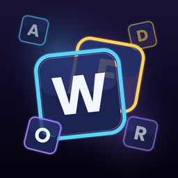

<p align="center">
  
</p>

# WordFall — a daily word game for Reddit

**Catch the falling letters. Dodge the shards. Spell your way up the board.**

WordFall is a fast, one-thumb daily word game built on **Devvit Web + Phaser**. Everyone in the subreddit plays the *same* seeded challenge each day, races the clock, and compares scores, longest words, and who cracked the hidden **Trick Word** — right in the comments.

It began life as a Godot arcade prototype (a space-shooter where you shot letters to build words). For this hackathon it was rebuilt from scratch for Reddit and reimagined into its own identity: a sleek neon void where glowing letter-tiles rain down and you **steer a prism to catch them** — no space, no shooting, mobile-first, and wrapped in a daily retention loop.

---

## The hook (why you come back tomorrow)

WordFall is engineered around a daily appointment loop that maps directly to the hackathon's award categories:

- **Daily Drop.** One shared, deterministic challenge per UTC day — same letters, same rule, same Trick Word for everyone. Skill decides the score, so the leaderboard is fair and the comments fill with "how did you get 900 on *that* board?!"
- **The Trick Word.** Each day hides a scrambled target word. Solve the anagram, then deliberately catch its letters mid-fall and submit it for a big bonus. It's a puzzle *inside* the arcade game — and prime comment-bait ("today's `WROHEVE` = HOWEVER, gg").
- **Rotating daily rules.** Every day runs a different mutator — *Vowel Rush*, *Long Haul*, *Rare Gems*, *Consonant Chaos*, *Featherweight*, *Combo Frenzy* — so strategy changes daily and tomorrow's rule is previewed on the results screen (foreshadowing = a reason to return).
- **Streaks + leaderboards.** A daily streak (🔥) you don't want to break, plus two live boards: **Top Score** and **Longest Word**. Both are fun to chase; both are social.
- **Share to comments.** One tap posts your result as a comment, turning every run into a thread and every thread into a challenge.

Mapping to the sub-challenges: **Retention** (daily seed, streaks, rules, leaderboards, tomorrow-teaser) · **User Contributions** (auto-posted result comments + the Trick Word discussion that naturally forms) · **Phaser** (100% procedural art, custom particle/juice, fully responsive scene system).

---

## How to play

1. **Steer** — drag anywhere (or use ← → / A D) to glide your prism catcher.
2. **Catch letters** — run into glowing letter-tiles to collect them into your word.
3. **Dodge shards** — jagged red shards cost a heart on contact (3 hearts → out). ~10% of what falls is a hazard.
4. **Grab bonuses** — glowing orbs give +time, +hearts, extra ⌫ deletes, and bonus gems.
5. **Submit** — tap **SUBMIT** to score your word. Longer & rarer words score more; consecutive valid words build a combo multiplier.
6. **Crack the Trick Word** — unscramble the day's puzzle and spell it for a big bonus.
7. **Come back tomorrow** — new rule, new Trick Word, fresh board, longer streak.

Scoring uses Scrabble letter values + a length bonus, the active daily rule modifier, and a combo multiplier that caps at 1.6× (plus a small daily-streak boost). Runs last 2:00. Invalid submissions are gently penalized (failure is *fixable*, never punishing).

---

## What's a "significant update" from the original

The original WordFall was a Godot desktop space-shooter. This project keeps only the **core word-building idea** and rebuilds everything else:

- New engine & platform: **Godot → Devvit Web + Phaser + TypeScript**, running inside a Reddit post.
- New core mechanic: **shoot-to-collect → steer-to-catch + dodge-hazards** (mobile-native, no weapons).
- New identity: **space theme → neon "reimagine the fall"**, 100% procedurally generated art (no sprite sheets).
- New meta: fixed 5 levels → **infinite daily challenges** with a shared seed, rotating rules, and a hidden Trick Word.
- New retention & social layer: **server-backed leaderboards, streaks, profiles, and share-to-comments** via Redis + the Reddit API.
- New UI: **fully responsive**, auto-detecting portrait (mobile) vs landscape (desktop) and scaling pixel-perfectly to any viewport.

---

## Architecture

```
src/
├── shared/         # pure, deterministic logic shared by client & server
│   ├── rng.ts        # seeded PRNG + string hash
│   ├── daily.ts      # the daily engine: seed → rule, Trick Word, letter/hazard/bonus stream
│   ├── scoring.ts    # letter values, rules, combos
│   └── types.ts
├── server/         # Hono endpoints on Devvit's serverless runtime
│   ├── routes/api.ts     # /api/daily, /api/submit, /api/leaderboard, /api/share
│   ├── routes/cron.ts    # daily scheduled post
│   └── core/             # Redis store (boards/streaks/profiles), validation, post creation
└── client/         # Phaser game (mobile-first, responsive)
    ├── scenes/       # Boot · Home · Game · Results · HowTo · Leaderboard
    ├── textures.ts   # all procedural art
    ├── audio.ts      # all procedural Web Audio SFX (no audio files)
    ├── layout.ts     # portrait/landscape responsive layout engine
    ├── net.ts        # server adapter with offline/mock fallback
    └── ui.ts         # animated background, buttons, panels
```

Determinism is the backbone: `shared/daily.ts` turns a date into the entire day's challenge, so the client can render it and the server can independently re-derive it to validate submissions. Leaderboards are Redis sorted sets keyed by date; streaks advance on the real UTC calendar; a scheduled job drops a fresh post each morning.

The dictionary (80k words) loads once client-side for instant validation; the server does bounded sanity-checks on submitted scores/words to keep the shared boards honest.

---

## Run it

Requires **Node 22+**.

```bash
npm install
npm run login      # connect your Reddit developer account
npm run dev        # playtest live on your test subreddit
```

Other commands:

- `npm run build` — build client + server
- `npm run type-check` — TypeScript project build
- `npm run lint` — ESLint
- `npm run deploy` — upload a new version
- `npm run launch` — publish for review

Once installed on a subreddit, the app auto-creates the first post; moderators can also use the **"WordFall: create next daily post"** menu item, and the scheduler drops a new daily post every day at 12:00 UTC.

### Instant local preview

`wordfall-preview.html` is a self-contained, no-build demo of the game (open it in any browser) — handy for a quick look or recording without the Devvit toolchain.

---

## Brand assets

Brand art lives in [`assets/`](assets/) and mirrors the in-game neon identity — procedural letter-tiles in cyan / violet / gold on a deep-indigo void:

- `wordfall-icon-1024.png` · `wordfall-icon-256.png` — app / community icon
- `wordfall-banner-desktop-1920x384.png` — subreddit banner, desktop (1920×384)
- `wordfall-banner-mobile-1600x480.png` — subreddit banner, mobile (1600×480)

<p align="center">
  
</p>

---

Built for Reddit's *Games with a Hook* Hackathon. 🔤
